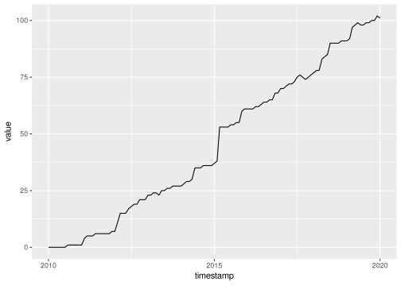

<!-- README.md is generated from README.Rmd. Please edit that file -->

# ohsome: An R package to interact with the ohsome API for OpenStreetMap history data aggregation and extraction

<!-- badges: start -->

[](LICENSE.md)
[](https://github.com/GIScience/badges#experimental)
<!-- badges: end -->

This ohsome R package grants access to the power of the
<a href="https://api.ohsome.org" target="blank">ohsome API</a> from R.
ohsome lets you analyze the rich data source of the
<a href="https://www.openstreetmap.org/" target="blank">OpenStreetMap</a>
(OSM) history. It aims to leverage the tools of the
<a href="https://github.com/GIScience/oshdb" target="blank">OpenStreetMap History Database</a>
(OSHDB).

With ohsome, you can …

-   Get **aggregated statistics** on the evolution of OpenStreetMap
    elements and specify your own temporal, spatial and/or thematic
    filters. The data aggregation endpoint allows you to access
    functions, e.g., to calculate the area of buildings or the length of
    streets at any given timestamp.

-   Retrieve the **geometry** of the historical OpenStreetMap data,
    e.g., to visualize the evolution of certain OpenStreetMap elements
    over time. You can get the geometries for specific points in time or
    all changes within a timespan (full-history).

## Installation

You can install ohsome from
<a href="https://github.com/GIScience/ohsome-r" target="blank">Github</a>:

``` r
remotes::install_github("GIScience/ohsome-r")
```

## Getting started

Upon attaching the ohsome package, a metadata request is sent to the
ohsome API. The package message provides some essential metadata
information, such as the current temporal extent of the underlying
OSHDB:

``` r
library(ohsome)
#> Data: © OpenStreetMap contributors https://ohsome.org/copyrights
#> ohsome API version: 1.5.0
#> Temporal extent: 2007-10-08 to 2021-07-11 21:00:00
```

The metadata is stored in `.ohsome_metadata`. You can print it to the
console to get more details.

### Aggregating OpenStreetMap elements

This early version of the ohsome R package provides wrapper functions
for the elements aggregation endpoints only. With these functions you
can query the ohsome API for the aggregated amount, length, area or
perimeter of OpenStreetMap elements with given properties, within given
boundaries and at given points in time.

Let us create a query for the total amount of breweries on OSM in the
region of Franconia. The first argument to `ohsome_elements_count()` is
the `sf` object `franconia` that is included in the `mapview` package
and contains boundary polygons of the 37 districts of the region:

``` r
library(mapview)

q <- ohsome_elements_count(franconia, filter = "craft=brewery")
```

The resulting `ohsome_query` object can be sent to the ohsome API with
`ohsome_post()`. By default, `ohsome_post()` returns the parsed API
response. In this case, this is a simple `data.frame` of only one row.

``` r
ohsome_post(q)
#> Warning: Time parameter is not defined and defaults to latest available
#> timestamp within the underlying OSHDB. You can use set_time() to set the time
#> parameter.
#>             timestamp value
#> 1 2021-07-11 21:00:00   125
```

`ohsome_post()` has issued a warning that the time parameter of the
query was not defined. The `ohsome` API returns the number of elements
at the latest available timestamp by default.

Defining the `time` parameter unlocks the full power of ohsome API by
giving access to the OSM history. The `time` parameter requires one or
more
<a href="https://docs.ohsome.org/ohsome-api/stable/time.html" target="blank">ISO-8601 conform timestring(s)</a>.
Here is how to create a query for the number of breweries at the first
of each month between 2010 and 2020:

``` r
ohsome_elements_count(franconia, filter = "craft=brewery", time = "2010/2020/P1M")
```

Alternatively, we can update the existing `ohsome_query` object `q` with
the `set_time()` function, pipe [1] the modified query directly into
`ohsome_post()` and make a quick visualisation with `ggplot2`:

``` r
library(ggplot2)

q |> 
    set_time("2010/2020/P1M") |>
    ohsome_post() |>
    ggplot(aes(x = timestamp, y = value)) +
    geom_line()
```



This is how to query the total number of breweries in all of Franconia.
But what if we want to aggregate the amount per district? The
`set_endpoint()` function is used to change or append the endpoint path
of an API request. In this case, we would want to append
`groupBy/boundary` to the `elements/count` endpoint. The endpoint path
can either be given as a single string (`/groupBy/boundary`) or as a
character vector [2]:

``` r
library(dplyr)

q <- franconia |> 
    mutate(id = NAME_ASCI) |>
    ohsome_elements_count(filter = "craft=brewery", time = "2021-06-01")

q |>
    set_endpoint(c("groupBy", "boundary"), append = TRUE) |>
    ohsome_post()
#> Simple feature collection with 37 features and 3 fields
#> Geometry type: MULTIPOLYGON
#> Dimension:     XY
#> Bounding box:  xmin: 8.975926 ymin: 48.8625 xmax: 12.27535 ymax: 50.56422
#> Geodetic CRS:  WGS 84
#> First 10 features:
#>    value          groupByBoundaryId  timestamp                       geometry
#> 1      6  Bamberg, Kreisfreie Stadt 2021-06-01 MULTIPOLYGON (((10.92581 49...
#> 2      6 Bayreuth, Kreisfreie Stadt 2021-06-01 MULTIPOLYGON (((11.58157 49...
#> 3      0   Coburg, Kreisfreie Stadt 2021-06-01 MULTIPOLYGON (((10.95355 50...
#> 4      1      Hof, Kreisfreie Stadt 2021-06-01 MULTIPOLYGON (((11.93067 50...
#> 5     13         Bamberg, Landkreis 2021-06-01 MULTIPOLYGON (((10.87615 50...
#> 6     13        Bayreuth, Landkreis 2021-06-01 MULTIPOLYGON (((11.70656 50...
#> 7      6          Coburg, Landkreis 2021-06-01 MULTIPOLYGON (((10.88654 50...
#> 8      8                  Forchheim 2021-06-01 MULTIPOLYGON (((11.26376 49...
#> 9      4             Hof, Landkreis 2021-06-01 MULTIPOLYGON (((11.91989 50...
#> 10     1                    Kronach 2021-06-01 MULTIPOLYGON (((11.36979 50...
```

If you want your own identifiers for the geometries returned by ohsome,
your input `sf` object needs a column explicitly named `id`. You can use
`mutate()` or `rename()` from the `dplyr` package to create such a
column as in the example above.

By default, `ohsome_post()` returns an `sf` object whenever the ohsome
API is capable of delivering GeoJSON data. This is the case for elements
extraction queries as well as for aggregations grouped by boundaries.

Thus, you can easily create a choropleth map from the query results. In
addition, `density` can be added to the endpoint path in order to query
for breweries per area:

``` r
q |>
    set_endpoint(c("density", "groupBy", "boundary"), append = TRUE) |>
    ohsome_post() |>
    mapview(zcol = "value", layer.name = "Breweries per sqkm")
```


### Other queries

The ohsome API has endpoints not only for the aggregation of OSM
elements, but also for the aggregation of users and contributions, and
even for the extraction of elements, of their full history and of
contributions. Up to now, this ohsome R package provides wrapper
functions for element aggregation.

However, you can create any ohsome API query using the more generic
`ohsome_query()` function. It takes the endpoint path and any query
parameters as inputs. For information on all available endpoints with
their parameters, consult the
<a href="https://docs.ohsome.org/ohsome-api/stable/endpoints.html" target="blank">ohsome API documentation</a>
or have a look at `ohsome_endpoints`.

Here, we request the full history of OSM buildings for the district of
Schweinfurt City, filter for features that still exist and visualise all
building features with their year of creation:

``` r
meta <- ohsome_get_metadata()
start <- as.Date(meta$extractRegion$temporalExtent[1])
end <- as.Date(meta$extractRegion$temporalExtent[2])

schweinfurt <- franconia |> filter(NAME_ASCI == "Schweinfurt, Kreisfreie Stadt")


m <- ohsome_query(
    "elementsFullHistory/geometry",
    schweinfurt,
    filter = "building=* and geometry:polygon", 
    clipGeometry = "false"
) |> 
    set_time(paste(start, end, sep = ",")) |>
    set_properties("metadata") |>
    ohsome_post() |>
    janitor:: clean_names() |>
    group_by(osm_id) |>
    mutate(year = min(format(valid_from, "%Y"))) |>
    filter(valid_to == end) |>
    mapview(zcol = "year", lwd = 0, layer.name = "Year of Feature Creation")


m@map %>% leaflet::setView(10.23, 50.04, zoom = 13)
```


You may find using `clean_names()` from the `janitor` package helpful in
order to remove special characters from column names in the parsed
ohsome API response – just as in the example above.

### Bounding geometries

The ohsome API requires bounding geometries either as bounding polygons
(`bpolys`), bounding boxes (`bboxes`) or bounding circles (`bcircles`)
parameters to the query in a textual form (see
<a href="https://docs.ohsome.org/ohsome-api/stable/boundaries.html" target="blank">ohsome API documentation</a>).
The ohsome R package uses the generic function `ohsome_boundary()` under
the hood to make your life easier. It accepts a wider range of input
geometry formats, while guessing the right type of bounding geometry.

As seen above, `sf` objects can be passed into the `boundary` argument
of `ohsome_query()` and any of its wrapper functions. You can also
update queries with `set_boundary()`. The `sf` object will be converted
into GeoJSON and passed into the `bpolys` parameter of the query.

There are also the following methods of `ohsome_boundary()` for other
classes of input geometry objects:

1.  `bbox` objects created with `st_bbox` are converted into a textual
    `bboxes` parameter to the query:

``` r
q <- ohsome_query("users/count") |>
    set_boundary(sf::st_bbox(franconia))

q$body$bboxes
#> [1] "8.97592600000002,48.862505,12.2753535,50.5642245"
```

2.  `matrix` objects created with `sp::bbox()`, `raster::bbox()` or
    `terra::bbox()` are also converted into a textual `bboxes`
    parameter. This even applies for matrices created with
    `osmdata::getbb()`, so that you can comfortably acquire bounding
    boxes for many places in the world:

``` r
osmdata::getbb("Kigali") |> 
    ohsome_elements_length(time = "2018/2018-12/P1M", filter = "route=bus") |>
    ohsome_post()
#>     timestamp     value
#> 1  2018-01-01  28251.24
#> 2  2018-02-01  28251.24
#> 3  2018-03-01  29103.11
#> 4  2018-04-01 186645.71
#> 5  2018-05-01 378185.54
#> 6  2018-06-01 473065.23
#> 7  2018-07-01 615801.98
#> 8  2018-08-01 648385.19
#> 9  2018-09-01 753618.88
#> 10 2018-10-01 771239.17
#> 11 2018-11-01 847337.73
#> 12 2018-12-01 858886.63
```

3.  You can pass any `character` object with text in the
    <a href="https://docs.ohsome.org/ohsome-api/stable/boundaries.html" target="blank">format allowed by the ohsome API</a>
    to `ohsome_boundary()` – even GeoJSON FeatureCollections. It will
    automatically detect whether you have passed the definition of
    `bpolys`, `bboxes` or `bcircles`. It is possible to use `character`
    vectors where each element represents one geometry:

``` r
c("Circle 1:8.6528,49.3683,1000", "Circle 2:8.7294,49.4376,1000") |>
    ohsome_elements_count(filter = "amenity=*", time = 2021) |>
    set_endpoint("groupBy/boundary", append = TRUE) |>
    ohsome_post()
#> Simple feature collection with 2 features and 3 fields
#> Geometry type: POLYGON
#> Dimension:     XY
#> Bounding box:  xmin: 8.639026 ymin: 49.35931 xmax: 8.743193 ymax: 49.44659
#> Geodetic CRS:  WGS 84
#>   value groupByBoundaryId  timestamp                       geometry
#> 1    16          Circle 1 2021-01-01 POLYGON ((8.666574 49.36834...
#> 2    20          Circle 2 2021-01-01 POLYGON ((8.743193 49.43763...
```

⚠️ While `sf` and `bbox` objects will be automatically transformed to
WGS 84 if in a different coordinate reference system, coordinates in
`character` and `matrix` objects always need to be provided as WGS 84.

### Modifying queries

As seen above, existing `ohsome_query` objects can be modified by
`set_endpoint()`, `set_boundary()` or `set_time()`. The latter and other
functions such as `set_filter()` are just wrappers around the more
generic `set_parameters()`. This can be used to modify the parameters of
a query in any possible way:

``` r
q <- ohsome_elements_count("8.5992,49.3567,8.7499,49.4371")

q |>
    set_endpoint("ratio", append = TRUE) |>
    set_parameters(
        filter = "building=*", 
        filter2 = "building=* and building:levels=*",
        time = "2010/2020/P2Y"
    ) |>
    ohsome_post()
#>    timestamp value value2    ratio
#> 1 2010-01-01   554      3 0.005415
#> 2 2012-01-01 10600      7 0.000660
#> 3 2014-01-01 21005     77 0.003666
#> 4 2016-01-01 25849    798 0.030872
#> 5 2018-01-01 29397   1223 0.041603
#> 6 2020-01-01 31495   1456 0.046230
```

### Dealing with complex API responses

The ohsome API allows grouping aggregate values for various timestamps
by boundary and tag at the same time. The parsed content of the response
can be rather complex. In the following case, building feature counts
for the districts of Franconia at two different timestamps are requested
– additionally grouped by the building:levels tag. To avoid lots of
redundant geometries, comma-separated values (instead of GeoJSON) are
explicitly requested as the response format:

``` r
building_levels <- franconia |>
    mutate(id  = NUTS_ID) |>
    ohsome_elements_count(filter = "building=*", time = "2015/2020", format = "csv") |>
    set_endpoint("groupBy/boundary/groupBy/tag", reset_format = F, append = T) |>
    set_groupByKey("building:levels") |>
    ohsome_post()

dim(building_levels)
#> [1]    2 1999
```

The query results in a very confusing data.frame with 1999 columns and 2
rows! This happens because there is a building count column for each
combination of boundary polygon and number of levels, while the two
requested timestamps are in the rows. Fortunately, there is the `tidyr`
package to do its magic and pivot this table into a long format with one
value per row:

``` r
library(tidyr)

building_levels |>
    pivot_longer(-timestamp, names_to = c("id", "levels"), names_sep = "_")
#> # A tibble: 3,996 x 4
#>    timestamp           id    levels            value
#>    <dttm>              <chr> <chr>             <dbl>
#>  1 2015-01-01 00:00:00 DE241 remainder          4311
#>  2 2015-01-01 00:00:00 DE241 building.levels.1  6347
#>  3 2015-01-01 00:00:00 DE241 building.levels.2  6727
#>  4 2015-01-01 00:00:00 DE241 building.levels.3  2787
#>  5 2015-01-01 00:00:00 DE241 building.levels.4   745
#>  6 2015-01-01 00:00:00 DE241 building.levels.5    96
#>  7 2015-01-01 00:00:00 DE241 building.levels.6    38
#>  8 2015-01-01 00:00:00 DE241 building.levels.9     7
#>  9 2015-01-01 00:00:00 DE241 building.levels.0     0
#> 10 2015-01-01 00:00:00 DE241 building.levels.7    32
#> # ... with 3,986 more rows
```

[1] Instead of the new R native pipe `|>` you may choose to use
`magrittr`’s `%>%`.

[2] The order of the elements in the character vector is critical!
