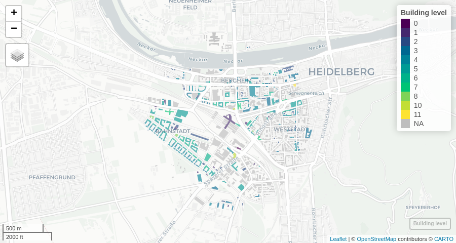
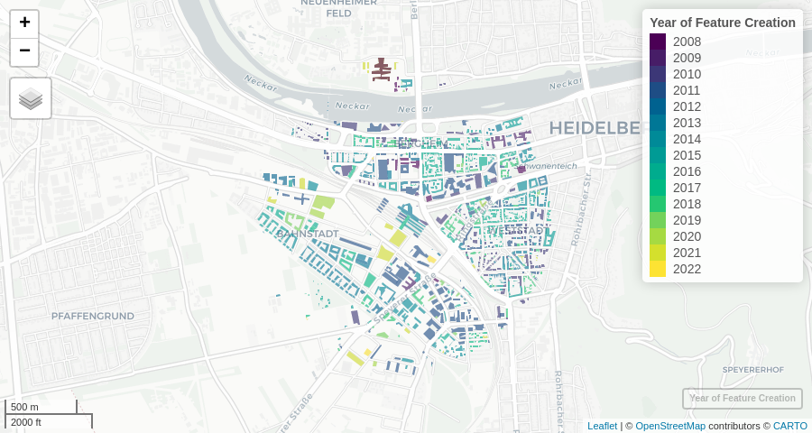

<!-- README.md is generated from README.Rmd. Please edit that file -->

# ohsome: An R package to interact with the ohsome API for OpenStreetMap history data aggregation and extraction

<!-- badges: start -->

[](LICENSE.md)
[](https://github.com/GIScience/badges#experimental)
<!-- badges: end -->

This ohsome R package grants access to the power of the
<a href="https://api.ohsome.org" target="blank">ohsome API</a> from R.
ohsome lets you analyze the rich data source of the
<a href="https://www.openstreetmap.org/" target="blank">OpenStreetMap</a>
(OSM) history. It aims to leverage the tools of the
<a href="https://github.com/GIScience/oshdb" target="blank">OpenStreetMap History Database</a>
(OSHDB).

With ohsome, you can …

-   Get **aggregated statistics** on the evolution of OpenStreetMap
    elements and specify your own temporal, spatial and/or thematic
    filters. The data aggregation endpoint allows you to access
    functions, e.g., to calculate the area of buildings or the length of
    streets at any given timestamp.

-   Retrieve the **geometry** of the historical OpenStreetMap data,
    e.g., to visualize the evolution of certain OpenStreetMap elements
    over time. You can get the geometries for specific points in time or
    all changes within a timespan (full-history).

## Installation

You can install ohsome from
<a href="https://github.com/GIScience/ohsome-r" target="blank">GitHub</a>:

``` r
remotes::install_github("GIScience/ohsome-r", ref = "dev-0.2.0")
```

## Getting started

Upon attaching the ohsome package, a metadata request is sent to the
ohsome API. The package message provides some essential metadata
information, such as the current temporal extent of the underlying
OSHDB:

``` r
library(ohsome)
```

The metadata is stored in `ohsome_metadata`. You can print it to the
console to get more details.

You can create any ohsome API query using the generic `ohsome_query()`
function. It takes the endpoint path and any query parameters as inputs.
For information on all available endpoints with their parameters,
consult the
<a href="https://docs.ohsome.org/ohsome-api/stable/endpoints.html" target="blank">ohsome API documentation</a>
or print `ohsome_endpoints` to the console.

However, this ohsome R package provides specific wrapper functions for
queries to all available endpoints.

### OSM elements

#### Aggregating OSM elements

The
<a href="https://docs.ohsome.org/ohsome-api/stable/endpoints.html#elements-aggregation" target="blank">elements aggregation endpoints</a>
of the ohsome API allow querying for the aggregated amount, length, area
or perimeter of OpenStreetMap elements with given properties, within
given boundaries and at given points in time.

Let us create a query for the total amount of breweries on OSM in the
region of Franconia. The first argument to `ohsome_elements_count()` is
the `sf` object `franconia` that is included in the
<a href="https://r-spatial.github.io/mapview/" target="blank">mapview</a>
package and contains boundary polygons of the 37 districts of the
region:

``` r
library(mapview)

q <- ohsome_elements_count(franconia, filter = "craft=brewery")
```

The resulting `ohsome_query` object can be sent to the ohsome API with
`ohsome_post()`. By default, `ohsome_post()` returns the parsed API
response. In this case, this is a simple `data.frame` of only one row.

``` r
ohsome_post(q)
#>             timestamp value
#> 1 2022-05-15 20:00:00   146
```

The `ohsome_query` object was created without an explicit `time`
parameter. When using functions to create element aggregation queries,
`time` defaults to the most recent available timestamp in the underlying
OSHDB.

Defining the `time` parameter unlocks the full power of ohsome API by
giving access to the OSM history. It requires one or more
<a href="https://docs.ohsome.org/ohsome-api/stable/time.html" target="blank">ISO-8601 conform timestring(s)</a>.
Here is how to create a query for the number of breweries at the first
of each month between 2010 and 2020:

``` r
ohsome_elements_count(franconia, filter = "craft=brewery", time = "2010/2020/P1M")
```

Alternatively, we can update the existing `ohsome_query` object `q` with
the `set_time()` function, pipe [1] the modified query directly into
`ohsome_post()` and make a quick visualization with `ggplot2`:

``` r
library(ggplot2)

q |> 
    set_time("2010/2020/P1M") |>
    ohsome_post() |>
    ggplot(aes(x = timestamp, y = value)) +
    geom_line()
```


This is how to query the total number of breweries in all of Franconia.
But what if we want to aggregate the amount per district? The ohsome API
provides specific endpoints for different grouped calculations, such as
aggregation grouped by bounding geometry.

There are several ways to define a query for an aggregation grouped by
boundary:

The `set_endpoint`function is used to change or append the endpoint path
of an API request. In this case, we could append `groupBy/boundary` to
the existing query to the `elements/count` endpoint. The endpoint path
can either be given as a single string (`/groupBy/boundary`) or as a
character vector:
`set_endpoint(q, c("groupBy", "boundary"), append = TRUE)` [2].

More comfortably, however, is the use of either the grouping argument
with an elements aggregation function (e.g. 
`ohsome_elements_count(grouping = "boundary)`) or of the
`set_grouping()` function to modify an existing query object:

``` r
library(dplyr)

franconia |> 
    mutate(id = NAME_ASCI) |>
    ohsome_elements_count(filter = "craft=brewery", time = "2021-06-01") |>
    set_grouping("boundary") |>
    ohsome_post()
#> Simple feature collection with 37 features and 3 fields
#> Geometry type: MULTIPOLYGON
#> Dimension:     XY
#> Bounding box:  xmin: 8.975926 ymin: 48.8625 xmax: 12.27535 ymax: 50.56422
#> Geodetic CRS:  WGS 84
#> First 10 features:
#>             groupByBoundaryId value  timestamp                       geometry
#> 1   Bamberg, Kreisfreie Stadt     6 2021-06-01 MULTIPOLYGON (((10.92581 49...
#> 2  Bayreuth, Kreisfreie Stadt     6 2021-06-01 MULTIPOLYGON (((11.58157 49...
#> 3    Coburg, Kreisfreie Stadt     0 2021-06-01 MULTIPOLYGON (((10.95355 50...
#> 4       Hof, Kreisfreie Stadt     1 2021-06-01 MULTIPOLYGON (((11.93067 50...
#> 5          Bamberg, Landkreis    13 2021-06-01 MULTIPOLYGON (((10.87615 50...
#> 6         Bayreuth, Landkreis    13 2021-06-01 MULTIPOLYGON (((11.70656 50...
#> 7           Coburg, Landkreis     6 2021-06-01 MULTIPOLYGON (((10.88654 50...
#> 8                   Forchheim     8 2021-06-01 MULTIPOLYGON (((11.26376 49...
#> 9              Hof, Landkreis     4 2021-06-01 MULTIPOLYGON (((11.91989 50...
#> 10                    Kronach     1 2021-06-01 MULTIPOLYGON (((11.36979 50...
```

If you want your own identifiers for the geometries returned by ohsome,
your input `sf` object needs a column explicitly named `id`. You can use
`mutate()` or `rename()` from the
<a href="https://dplyr.tidyverse.org" target="blank">dplyr</a> package
to create such a column as in the example below.

By default, `ohsome_post()` returns an `sf` object whenever the ohsome
API is capable of delivering GeoJSON data. This is the case for elements
extraction queries as well as for aggregations grouped by boundaries.

Thus, you can easily create a choropleth map from the query results. In
addition, you can set the argument `return_value` to `density`. This
will modify the endpoint path of the query so that ohsome return the
number of breweries per area instead of the absolute value:

``` r
franconia |> 
    mutate(id = NAME_ASCI) |>
    ohsome_elements_count(filter = "craft=brewery", return_value = "density") |>
    set_time("2021-06-01") |>
    set_grouping("boundary") |>
    ohsome_post() |>
    mapview(zcol = "value", layer.name = "Breweries per sqkm")
```


#### Extracting OSM elements

The
<a href="https://docs.ohsome.org/ohsome-api/stable/endpoints.html#elements-extraction" target="blank">elements extraction endpoints</a>
of the ohsome API allow obtaining geometries, bounding boxes or
centroids of OSM elements with given properties, within given boundaries
and at given points in time. Together with the elements, you can choose
to query for their tags and/or their metadata such as the changeset ID,
the time of the last edit or the version number.

The following query extracts the geometries of buildings within 1000 m
of Heidelberg main station with their tags. The response is used to
visualize the buildings and the values of their `building:levels` tag
(if available):

``` r
hd_station_1km <- ohsome_boundary("8.67542,49.40347,1000")

ohsome_elements_geometry(
    boundary = hd_station_1km, 
    filter = "building=* and type:way", 
    time = "2021-12-01",
    properties = "tags", 
    clipGeometry = FALSE
) |>
    ohsome_post() |>
    transmute(level = factor(`building:levels`)) |>
    mapview(zcol = "level", lwd = 0, layer.name = "Building level")
```



Similarly, you can use `ohsome_elements_centroid()` to extract centroids
of OSM elements and `ohsome_elements_bbox()` for their bounding boxes.
Note that OSM node elements (with point geometries) are omitted from the
results if querying for bounding boxes.

#### Extracting the full history of OSM elements

While the elements extraction endpoints provide geometries and
properties of OSM elements at specific timestamps, results of queries to
the
<a href="https://docs.ohsome.org/ohsome-api/v1/endpoints.html#elements-full-history-extraction" target="blank">full history endpoints</a>
will include all changes to matching OSM features with corresponding
`validFrom` and `validTo` timestamps.

Here, we request the full history of OSM buildings within 1000 m of
Heidelberg main station, filter for features that still exist and
visualize all building features with their year of creation:

``` r
meta <- ohsome_get_metadata()
#> Data: © OpenStreetMap contributors https://ohsome.org/copyrights
#> ohsome API version: 1.6.3
#> Temporal extent: 2007-10-08 to 2022-05-15 20:00:00
start <- as.Date(meta$extractRegion$temporalExtent[1])
end <- as.Date(meta$extractRegion$temporalExtent[2])

ohsome_elementsFullHistory_geometry(
    boundary = hd_station_1km,
    time = c(start, end),
    filter = "building=* and geometry:polygon", 
    clipGeometry = FALSE,
    properties = "metadata"
) |> 
    ohsome_post() |>
    janitor:: clean_names() |>
    group_by(osm_id) |>
    mutate(year = min(format(valid_from, "%Y"))) |>
    filter(valid_to == end) |>
    mapview(zcol = "year", lwd = 0, layer.name = "Year of Feature Creation")
```



You may find using `clean_names()` from the
<a href="https://github.com/sfirke/janitor" target="blank">janitor</a>
package helpful in order to remove special characters from column names
in the parsed ohsome API response – just as in the example above.

### OSM contributions

#### Aggregating OSM contributions

With queries to the ohsome API’s
<a href="https://docs.ohsome.org/ohsome-api/v1/endpoints.html#contributions-aggregation" target="blank">contributions aggregation endpoints</a>,
you can get counts of the contributions provided by users to OSM. The
following code requests the number of deletions of man-made objects at
the location of the hypothetical
<a href="https://en.wikipedia.org/wiki/Null_Island" target="blank">Null Island</a>
per year between 2010 and 2020:

``` r
ohsome_contributions_count(
    boundary = "0,0,10", 
    filter = "man_made=*", 
    time = "2010/2020/P1Y",
    contributionType = "deletion"
) |>
    ohsome_post()
#>    fromTimestamp toTimestamp value
#> 1     2010-01-01  2011-01-01     0
#> 2     2011-01-01  2012-01-01     1
#> 3     2012-01-01  2013-01-01     0
#> 4     2013-01-01  2014-01-01     0
#> 5     2014-01-01  2015-01-01     0
#> 6     2015-01-01  2016-01-01     3
#> 7     2016-01-01  2017-01-01     1
#> 8     2017-01-01  2018-01-01     8
#> 9     2018-01-01  2019-01-01     4
#> 10    2019-01-01  2020-01-01     4
```

The `contributionType` parameter is used to filter for specific types of
contributions (in this case: deletions). If it is not set, any
contribution is counted. Note that the resulting values apply to time
intervals defined by a `fromTimestamp` and a `toTimestamp`.

#### Extracting OSM contributions

The
<a href="https://docs.ohsome.org/ohsome-api/v1/endpoints.html#contributions-extraction" target="blank">contributions extraction</a>
endpoints of the ohsome API can be used to extract feature geometries of
contributions.

In the following example, we extract the centroids all amenities in the
Berlin city district of Neukölln that have had contributions in March
2020. Consequently, we filter for features that have had tags changed
and visualize their locations:

``` r
nominatimlite::geo_lite_sf("Berlin Neukölln", points_only = FALSE) |>
    ohsome_contributions_centroid() |>
    set_filter("amenity=*") |>
    set_time("2020-03,2020-04") |>
    set_properties("contributionTypes") |> 
    ohsome_post() |>
    filter(`@tagChange`) |>
    mapview(layer.name = "Amenities with Tag Changes")
#> Warning: 60 element(s) with empty geometries omitted.
```


### OSM users

You can get statistics on the number of users editing specific features
through the
<a href="https://docs.ohsome.org/ohsome-api/v1/endpoints.html#users-aggregation" target="blank">users aggregation</a>
endpoints of the ohsome API.

Here, we show the number of users editing buildings before, during and
after Nepal earthquake 2015:

``` r
ohsome_users_count(
    boundary = "82.3055,6.7576,87.4663,28.7025",
    filter = "building=* and geometry:polygon",
    time = "2015-03-01/2015-08-01/P1M"
) |>
    ohsome_post()
#>   fromTimestamp toTimestamp value
#> 1    2015-03-01  2015-04-01    97
#> 2    2015-04-01  2015-05-01  3489
#> 3    2015-05-01  2015-06-01  3103
#> 4    2015-06-01  2015-07-01   478
#> 5    2015-07-01  2015-08-01   185
```

### Bounding geometries

The ohsome API requires bounding geometries either as bounding polygons
(`bpolys`), bounding boxes (`bboxes`) or bounding circles (`bcircles`)
parameters to the query in a textual form (see
<a href="https://docs.ohsome.org/ohsome-api/stable/boundaries.html" target="blank">ohsome API documentation</a>).
The ohsome R package uses the generic function `ohsome_boundary()` under
the hood to make your life easier. It accepts a wider range of input
geometry formats, while guessing the right type of bounding geometry.

As seen above, `sf` objects can be passed into the `boundary` argument
of `ohsome_query()` and any of its wrapper functions. You can also
update queries with `set_boundary()`. The `sf` object will be converted
into GeoJSON and passed into the `bpolys` parameter of the query.

If you wish to aggregate or extract OSM elements on administrative
boundaries in the `sf` format, you might want to check out packages such
as
<a href="https://github.com/ropensci/rnaturalearth" target="blank">rnaturalearth</a>,
<a href="https://github.com/rspatial/geodata" target="blank">geodata</a>,
<a href="https://github.com/rspatial/raster" target="blank">raster</a>
(in particular its `getData()` function),
<a href="https://gitlab.com/dickoa/rgeoboundaries" target="blank">rgeoboundaries</a>
or
<a href="https://github.com/dieghernan/nominatimlite" target="blank">nominatimlite</a>
for the acquisition of boundary data that can be used with
`ohsome_boundary()`.

There are also the following methods of `ohsome_boundary()` for other
classes of input geometry objects:

1.  `bbox` objects created with `st_bbox` are converted into a textual
    `bboxes` parameter to the query:

``` r
q <- ohsome_query("users/count") |>
    set_boundary(sf::st_bbox(franconia))

q$body$bboxes
#> [1] "8.97592600000002,48.862505,12.2753535,50.5642245"
```

2.  `matrix` objects created with `sp::bbox()`, `raster::bbox()` or
    `terra::bbox()` are also converted into a textual `bboxes`
    parameter. This even applies for matrices created with
    `osmdata::getbb()` and `tmaptools::bb()`, so that you can
    comfortably acquire bounding boxes from the Nominatim API:

``` r
osmdata::getbb("Kigali") |> 
    ohsome_elements_length(time = "2018/2018-12/P1M", filter = "route=bus") |>
    ohsome_post()
#>     timestamp     value
#> 1  2018-01-01  28251.24
#> 2  2018-02-01  28251.24
#> 3  2018-03-01  29103.11
#> 4  2018-04-01 186645.71
#> 5  2018-05-01 378185.54
#> 6  2018-06-01 473065.23
#> 7  2018-07-01 615801.98
#> 8  2018-08-01 648385.19
#> 9  2018-09-01 753618.88
#> 10 2018-10-01 771239.17
#> 11 2018-11-01 847337.73
#> 12 2018-12-01 858886.63
```

3.  You can pass any `character` object with text in the
    <a href="https://docs.ohsome.org/ohsome-api/stable/boundaries.html" target="blank">format allowed by the ohsome API</a>
    to `ohsome_boundary()` – even GeoJSON FeatureCollections. It will
    automatically detect whether you have passed the definition of
    `bpolys`, `bboxes` or `bcircles`. It is possible to use `character`
    vectors where each element represents one geometry:

``` r
c("Circle 1:8.6528,49.3683,1000", "Circle 2:8.7294,49.4376,1000") |>
    ohsome_elements_count(filter = "amenity=*", grouping = "boundary", time = 2021) |>
    ohsome_post()
#> Simple feature collection with 2 features and 3 fields
#> Geometry type: POLYGON
#> Dimension:     XY
#> Bounding box:  xmin: 8.639026 ymin: 49.35931 xmax: 8.743193 ymax: 49.44659
#> Geodetic CRS:  WGS 84
#>   groupByBoundaryId value  timestamp                       geometry
#> 1          Circle 1    16 2021-01-01 POLYGON ((8.666574 49.36834...
#> 2          Circle 2    20 2021-01-01 POLYGON ((8.743193 49.43763...
```

⚠️ While `sf` and `bbox` objects will be automatically transformed to
WGS 84 if in a different coordinate reference system, coordinates in
`character` and `matrix` objects always need to be provided as WGS 84.

### Modifying queries

As seen above, existing `ohsome_query` objects can be modified by
`set_endpoint()`, `set_grouping()`, `set_boundary()` or `set_time()`.
The latter and other functions such as `set_filter()` are just wrappers
around the more generic `set_parameters()`. This can be used to modify
the parameters of a query in any possible way:

``` r
q <- ohsome_elements_count("8.5992,49.3567,8.7499,49.4371")

q |>
    set_endpoint("ratio", append = TRUE) |>
    set_parameters(
        filter = "building=*", 
        filter2 = "building=* and building:levels=*",
        time = "2010/2020/P2Y"
    ) |>
    ohsome_post()
#>    timestamp value value2    ratio
#> 1 2010-01-01   554      3 0.005415
#> 2 2012-01-01 10600      7 0.000660
#> 3 2014-01-01 21005     77 0.003666
#> 4 2016-01-01 25849    798 0.030872
#> 5 2018-01-01 29397   1223 0.041603
#> 6 2020-01-01 31495   1456 0.046230
```

### Grouping

<a href="https://docs.ohsome.org/ohsome-api/v1/group-by.html" target="blank">Grouping endpoints</a>
are available for aggregation resources and can be used to compute the
aggregated results grouped by:

-   boundary,
-   key,
-   tag, and
-   type.

In many cases, a grouping by `boundary` can be combined with a grouping
by `tag`. Some of the grouping endpoints require additional query
parameters, e.g. `tag` groupings require a `groupByKey` parameter. Not
all grouping endpoints are available for all aggregation resources –
please consult the
<a href="https://docs.ohsome.org/ohsome-api/v1/group-by.html" target="blank">ohsome API documentation</a>
for details.

You can set the `grouping` argument to any aggregation endpoint wrapper
function (e.g. `ohsome_elements_count(grouping = c("boundary", "tag"))`)
or use `set_grouping()` to modify existing query objects.

### Density and ratio requests

Many
<a href="https://docs.ohsome.org/ohsome-api/v1/endpoints.html" target="blank">aggregation resources</a>
have endpoints for requesting density (i.e. count, length, perimeter or
area of features **per area**) or ratios (of OSM elements satisfying a
`filter2` to elements satisfying a `filter`) instead of or in addition
to absolute values.

You can request density or ratio values by setting the `return_value`
argument to aggregation endpoint wrapper functions (e.g. 
`ohsome_elements_count(return_value = "density")`). Mind that ratio
endpoints require an additional `filter2` query parameter. Please
consult the
<a href="https://docs.ohsome.org/ohsome-api/v1/endpoints.html" target="blank">ohsome API documentation</a>
or print `names(ohsome_endpoints)` to the console in order to check for
the availability of specific density and ratio endpoints.

### Dealing with complex API responses

The ohsome API allows grouping aggregate values for various timestamps
by boundary and tag at the same time. The parsed content of the response
can be rather complex. In the following case, building feature counts
for the districts of Franconia at two different timestamps are requested
– additionally grouped by the building:levels tag. To avoid lots of
redundant geometries, comma-separated values (instead of GeoJSON) are
explicitly requested as the response format:

``` r
building_levels <- franconia |>
    mutate(id  = NUTS_ID) |>
    ohsome_elements_count(grouping = c("boundary", "tag"), format = "csv") |>
    set_filter("building=* and geometry:polygon") |>
    set_time("2015/2020") |>
    set_groupByKey("building:levels") |>
    ohsome_post()

dim(building_levels)
#> [1]    2 1999
```

The query results in a confusing data.frame with 1999 columns and 2
rows. This happens because there is a building count column for each
combination of boundary polygon and number of levels, while the two
requested timestamps are in the rows. Fortunately, there is the
<a href="https://tidyr.tidyverse.org" target="blank">tidyr</a> package
to do its magic and pivot this table into a long format with one value
per row:

``` r
library(tidyr)

building_levels |>
    pivot_longer(-timestamp, names_to = c("id", "levels"), names_sep = "_")
#> # A tibble: 3,996 × 4
#>    timestamp           id    levels            value
#>    <dttm>              <chr> <chr>             <dbl>
#>  1 2015-01-01 00:00:00 DE241 remainder          4307
#>  2 2015-01-01 00:00:00 DE241 building.levels.1  6347
#>  3 2015-01-01 00:00:00 DE241 building.levels.2  6727
#>  4 2015-01-01 00:00:00 DE241 building.levels.3  2787
#>  5 2015-01-01 00:00:00 DE241 building.levels.4   745
#>  6 2015-01-01 00:00:00 DE241 building.levels.5    96
#>  7 2015-01-01 00:00:00 DE241 building.levels.6    38
#>  8 2015-01-01 00:00:00 DE241 building.levels.0     0
#>  9 2015-01-01 00:00:00 DE241 building.levels.9     7
#> 10 2015-01-01 00:00:00 DE241 building.levels.7    32
#> # … with 3,986 more rows
```

## How to cite this package

In order to cite this package in publications, please use the citation
information provided through `citation("ohsome")`.

------------------------------------------------------------------------

[1] Instead of the new R native pipe `|>` you may choose to use
`magrittr`’s `%>%`.

[2] The order of the elements in the character vector is critical!
