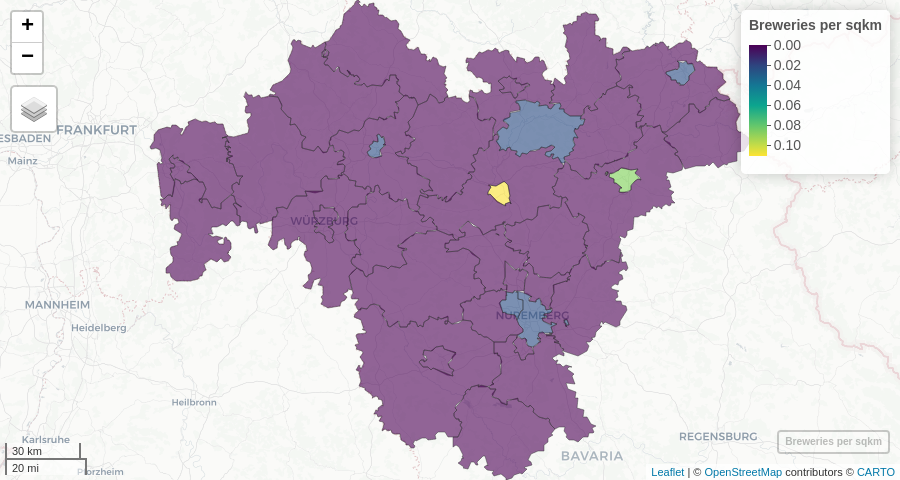

<!-- README.md is generated from README.Rmd. Please edit that file -->

# ohsome

<!-- badges: start -->
<!-- badges: end -->

This ohsome R package grants access to the power of the ohsome API from
R. ohsome is … OSHDB … OSM …

## Installation

If you have access to the repository and a
<a href="https://docs.gitlab.com/ee/user/profile/personal_access_tokens.html" target="blank">personal access token</a>,
you can install the development version of ohsome from GitLab:

``` r
Sys.setenv(GITLAB_PAT = your_personal_access_token)

remotes::install_gitlab(
    repo = "giscience/big-data/ohsome/libs/ohsome-r@develop",
    host = "https://gitlab.gistools.geog.uni-heidelberg.de"
)
```

## Getting started

Upon attaching the ohsome package, a metadata request is sent to the
ohsome API. The package message provides some essential metadata
information, such as the current temporal extent of the underlying
OSHDB:

``` r
library(ohsome)
#> Data: © OpenStreetMap contributors https://ohsome.org/copyrights
#> ohsome API version: 1.5.0
#> Temporal extent: 2007-10-08 to 2021-06-20 20:00:00
```

The metadata is stored in `.ohsome_metadata`. You can print it to the
console to get more details.

### Aggregate OpenStreetMap elements

This early version of the ohsome R package provides wrapper functions
for the elements aggregation endpoints only. With these functions you
can query the ohsome API for the aggregated amount, length, area or
perimeter of OpenStreetMap elements with given properties, within given
boundaries and at given points in time.

Here, we create a query for the total amount of breweries on OSM in the
German region of Franconia. The first argument to
`ohsome_elements_count()` is the `sf` object `franconia` that is
included in the `mapview` package:

``` r
library(mapview)

q <- ohsome_elements_count(franconia, filter = "craft=brewery")
```

The resulting `ohsome_query` object can be sent to the ohsome API with
`ohsome_post()`. By default, `ohsome_post()` returns the parsed API
response which is a simple data.frame in this case.

``` r
ohsome_post(q)
#> Warning: Time parameter is not defined and defaults to latest available
#> timestamp within the underlying OSHDB. You can use set_time() to set the time
#> parameter.
#>             timestamp value
#> 1 2021-06-20 20:00:00   125
```

We now know that there were 125 breweries in Franconia on OSM at a
certain point in time. However, `ohsome_post()` has issued a warning
that the time parameter of the query was not defined. Thus, the `ohsome`
API returned the number of elements at the latest available timestamp.

The
<a href="https://docs.ohsome.org/ohsome-api/stable/time.html" target="blank">time parameter</a>
allows to access the OSM history through the ohsome API. This would
create a query of the number of breweries at January 1st of each year
between 2010 and 2020:

``` r
franconia |> 
    ohsome_elements_count(filter = "craft=brewery", time = "2010/2020/P1Y")
```

Alternatively, we can update the existing `ohsome_query` object `q` with
the `set_time()` function, pipe the modified query directly into
`ohsome_post()` and make a quick visualisation with `ggplot2`:

``` r
library(ggplot2)

q |> 
    set_time("2010/2020/P1Y") |>
    ohsome_post() |>
    ggplot(aes(x = timestamp, y = value)) +
    geom_col()
```


This is how to query the total number of breweries in all of Franconia.
But what if we actually want to know the amount per each district? The
`set_endpoint()` function can be used to change or append to the
endpoint path of an API request. In this case, we would want to append
`/groupBy/boundary` to the `elements/count` endpoint. The endpoint path
can either be given as a single string (`/groupBy/boundary`) or as a
character vector[1]:

``` r
q <- set_time(q, "2021-06-01")

q |>
    set_endpoint(c("groupBy", "boundary"), append = TRUE) |>
    ohsome_post()
#> Simple feature collection with 37 features and 3 fields
#> Geometry type: MULTIPOLYGON
#> Dimension:     XY
#> Bounding box:  xmin: 8.975926 ymin: 48.8625 xmax: 12.27535 ymax: 50.56422
#> Geodetic CRS:  WGS 84
#> First 10 features:
#>    value groupByBoundaryId  timestamp                       geometry
#> 1      6          feature1 2021-06-01 MULTIPOLYGON (((10.92581 49...
#> 2      6          feature2 2021-06-01 MULTIPOLYGON (((11.58157 49...
#> 3      0          feature3 2021-06-01 MULTIPOLYGON (((10.95355 50...
#> 4      1          feature4 2021-06-01 MULTIPOLYGON (((11.93067 50...
#> 5     13          feature5 2021-06-01 MULTIPOLYGON (((10.87615 50...
#> 6     13          feature6 2021-06-01 MULTIPOLYGON (((11.70656 50...
#> 7      6          feature7 2021-06-01 MULTIPOLYGON (((10.88654 50...
#> 8      8          feature8 2021-06-01 MULTIPOLYGON (((11.26376 49...
#> 9      4          feature9 2021-06-01 MULTIPOLYGON (((11.91989 50...
#> 10     1         feature10 2021-06-01 MULTIPOLYGON (((11.36979 50...
```

By default, `ohsome_post()` returns an `sf` object whenever the ohsome
API is capable of delivering GeoJSON data – which is the case for
elements extraction queries as well as for aggregations grouped by
boundaries.

It is thus possible to easily create a choropleth map from the query
results. In addition, `density` can be added to the endpoint path in
order to query for breweries per area:

``` r
q |>
    set_endpoint(c("density", "groupBy", "boundary"), append = TRUE) |>
    ohsome_post() |>
    mapview(zcol = "value", layer.name = "Breweries per sqkm")
```



### Other queries

The ohsome API has endpoints not only for the aggregation of OSM
elements, but also for the aggregation of users and contributions, and
even for the extraction of elements, of their full history and of
contributions. Up to now, this ohsome R package provides wrapper
functions for element aggregation.

However, you can create any ohsome API query using the more generic
`ohsome_query()` function. It takes the endpoint path and any query
parameters as an input. For information on all available endpoints with
their parameters, consult the
<a href="https://docs.ohsome.org/ohsome-api/stable/endpoints.html" target="blank">ohsome API documentation</a>
or have a look at `ohsome_endpoints`.

Here’s a query to extract the geometries of building polygons:

``` r
q <- ohsome_query(
    c("elements", "geometry"), 
    filter = "building=* and geometry:polygon", 
    clipGeometry = "false"
)
```

One of the downsides of this approach is that you cannot just pass `sf`
objects as bounding polygons into the query. You would need to define
the bounding geometries (`bpolys`, `bboxes` or `bcircles`) as parameters
to the query just as described in the \[ohsome API
documentation\](<https://docs.ohsome.org/ohsome-api/stable/boundaries.html%7Btarget=blank%7D>.

However, you can also just add bounding geometries with `set_boundary()`
to any existing `ohsome_query` object:

``` r
schweinfurt <- subset(franconia, NAME_ASCI == "Schweinfurt, Kreisfreie Stadt")

q <- set_boundary(q, schweinfurt)
```

In the following, we request OSM building geometries for the district of
Schweinfurt City at the end of each year from 2007 to 2020, filter for
the earliest version of each feature that still exists in 2020 (by OSM
id) and visualise all buildings features with their year of creation:

``` r
library(dplyr)
#> 
#> Attache Paket: 'dplyr'
#> Die folgenden Objekte sind maskiert von 'package:stats':
#> 
#>     filter, lag
#> Die folgenden Objekte sind maskiert von 'package:base':
#> 
#>     intersect, setdiff, setequal, union

q |> 
    set_time("2007-12-31T23:59:59/2020-12-31T23:59:59/P1Y") |>
    ohsome_post() |>
    janitor:: clean_names() |>
    mutate(year = format(snapshot_timestamp, "%Y")) |>
    group_by(osm_id) |>
    filter(any(year == 2020)) |>
    top_n(-1, wt = year) |>
    mapview(zcol = "year", lwd = 0, layer.name = "Year of Feature Creation")
```


You may find using `clean_names()` from the `janitor` package helpful in
order to remove special characters from column names in the parsed
ohsome API response – just as in the example above.

### Bounding geometries

The ohsome API requires bounding geometries either as bounding polygons
(`bpolys`), bounding boxes (`bboxes`) or bounding circles (`bcircles`)
parameters to the query in a textual form. The ohsome R package uses the
generic function `ohsome_boundary()` under the hood to make your life
easier and accept a wider range of input geometry formats, while
guessing the right type of bounding geometry.

As seen above, `sf` objects can be passed into any of the wrapper
functions of `ohsome_query()` (though not `ohsome_query()` itself) or
into `set_boundary()`. The `sf` will be converted into GeoJSON and
passed into the `bpolys` parameter of the query.

There are also the following methods of `ohsome_boundary()` for other
classes of input geometry objects.

1.  There is a method for `bbox` objects created with `st_bbox` that
    converts the object into a textual `bboxes` parameter to the query:

``` r
ohsome_query("users/count") |>
    set_boundary(sf::st_bbox(franconia))
#> $url
#> [1] "https://api.ohsome.org/v1/users/count"
#> 
#> $encode
#> [1] "form"
#> 
#> $body
#> $body$format
#> [1] "csv"
#> 
#> $body$bboxes
#> [1] "8.97592600000002,48.862505,12.2753535,50.5642245"
#> 
#> 
#> attr(,"class")
#> [1] "ohsome_query"
```

2.  `matrix` objects created with `sp::bbox()`, `raster::bbox` or
    `terra::bbox` are also converted into a textual `bboxes` parameter.
    This even applies for matrices created with `osmdata::getbb`, so
    that you can comfortably acquire bounding boxes for many places in
    the world:

``` r
osmdata::getbb("Kigali") |> 
    ohsome_elements_length(time = "2018/2018-12/P1M", filter = "route=bus") |>
    ohsome_post()
#>     timestamp     value
#> 1  2018-01-01  28251.24
#> 2  2018-02-01  28251.24
#> 3  2018-03-01  29103.11
#> 4  2018-04-01 186645.71
#> 5  2018-05-01 378185.54
#> 6  2018-06-01 473065.23
#> 7  2018-07-01 615801.98
#> 8  2018-08-01 648385.19
#> 9  2018-09-01 753618.88
#> 10 2018-10-01 771239.17
#> 11 2018-11-01 847337.73
#> 12 2018-12-01 858886.63
```

3.  You can pass any `character` object with text in the
    <a href="https://docs.ohsome.org/ohsome-api/stable/boundaries.html" target="blank">format allowed by the ohsome API</a>
    to `ohsome_boundary()` – even GeoJSON FeatureCollections. It will
    automatically detect whether you have passed the definition of
    `bpolys`, `bboxes` or `bcircles`.

It is also possible to use `character` vectors where each element
represents one geometry:

``` r
c("Circle 1:8.6528,49.3683,1000", "Circle 2:8.7294,49.4376,1000") |>
    ohsome_elements_count(filter = "amenity=*", time = 2021) |>
    set_endpoint("groupBy/boundary", append = TRUE) |>
    ohsome_post()
#> Simple feature collection with 2 features and 3 fields
#> Geometry type: POLYGON
#> Dimension:     XY
#> Bounding box:  xmin: 8.639026 ymin: 49.35931 xmax: 8.743193 ymax: 49.44659
#> Geodetic CRS:  WGS 84
#>   value groupByBoundaryId  timestamp                       geometry
#> 1    16          Circle 1 2021-01-01 POLYGON ((8.666574 49.36834...
#> 2    20          Circle 2 2021-01-01 POLYGON ((8.743193 49.43763...
```

⚠️ While `sf` and `bbox` objects will be automatically transformed to
WGS 84 if in a different coordinate reference system, coordinates in
`character` and `matrix` objects always need to be provided as WGS 84.

[1] The order of the elements in the character vector is critical!
